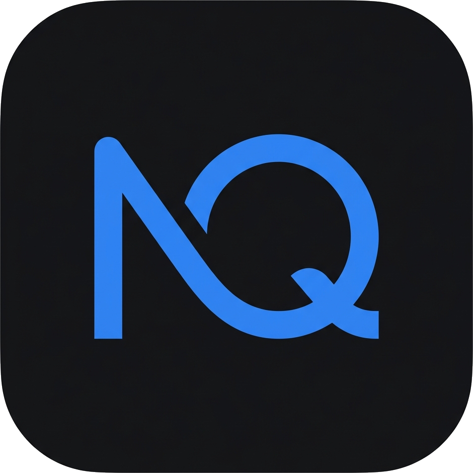

<p align="center">
  
</p>
<p align="center">
  <strong>NexQ 腾讯群面 Copilot</strong>
</p>
<p align="center">
  腾讯群面实时战术 Copilot · 全中文界面 · 本地中文转写 · Win11
</p>

<p align="center">

[](LICENSE)
[](../../releases)
[](https://v2.tauri.app/)
[](https://react.dev/)
[](https://www.rust-lang.org/)

</p>

---

## 这是什么

一款面向**腾讯群面（无领导小组讨论）**的实时战术 Copilot。应用同时采集你的麦克风和腾讯会议的系统声音，本地离线转写成中文文字，群面战术引擎**自动**持续分析讨论，在合适的时机给出可直接说出口的发言建议，显示在一个只有你能看到的置顶悬浮窗里。

### 核心特性

- 🎯 **群面战术盘**——自动维护讨论状态：【局势】【缺口】【动作】【建议发言】四字段极简视图，像仪表盘一样回答"现在该说什么"
- 🤖 **自动调度**——别人说完一段话自动分析；10 秒最小间隔、15 秒快速刷新、Space 强制触发、建议 20 秒自动失效、无价值内容不硬凑（显示"不要抢话"）
- 🎙️ **本地中文转写**——默认 Sherpa-ONNX 中文流式模型，全程离线、免费、无需 API Key，支持 Deepgram 等云端引擎切换
- 🇨🇳 **全中文界面**——向导、设置、悬浮窗、托盘菜单全部中文化
- 🔒 **隐私优先**——转写本地完成；API 密钥存 Windows 凭据管理器；不经手任何第三方中转
- 📊 **完整会中能力**——转写记录、AI 问答、书签、发言人统计、会议摘要、行动项提取、翻译

## 使用教程

**看这里就够了：[docs/使用教程.md](docs/使用教程.md)** —— 配有真实界面截图，从安装配置到会上实战手把手讲解。

## 技术栈

| 层 | 技术 |
|---|---|
| 桌面端 | Tauri 2 (Rust + WebView2) |
| 前端 | React 18, TypeScript 5.5, Vite 6, Zustand |
| 音频 | cpal, WASAPI (Windows loopback) |
| STT | Sherpa-ONNX（本地中文）/ Deepgram / Groq / Whisper 等 10 种 |
| LLM | OpenRouter / OpenAI / Anthropic / Gemini / Ollama 等 8 种 |
| 数据库 | SQLite (rusqlite) |

## 开发

```bash
# 环境要求：Node.js 20+、Rust stable、VS C++ Build Tools、CMake、Ninja、LLVM (libclang)
npm install

# 开发模式
npx tauri dev

# 构建 NSIS 安装包
npx tauri build
```

## 免责声明

实时辅助工具的使用请自行确认招聘方规则、会议隐私以及录音/转写相关法律要求。本仓库仅供学习交流。

## License

[MIT](LICENSE)

## 🙏 致谢

本项目的诞生离不开 **[NexQ](https://github.com/VahidAlizadeh/NexQ)** —— 一个优秀的开源 AI 会议助手项目。感谢原作者 [@VahidAlizadeh](https://github.com/VahidAlizadeh) 及所有贡献者的无私开源：本项目构建在其音频采集、多引擎 STT 架构、LLM 接入与桌面框架之上，并在此基础上面向腾讯群面场景做了中文本地化与战术引擎扩展。如果你需要一个通用的多语言会议助手，强烈推荐使用原版 [NexQ](https://github.com/VahidAlizadeh/NexQ)。
