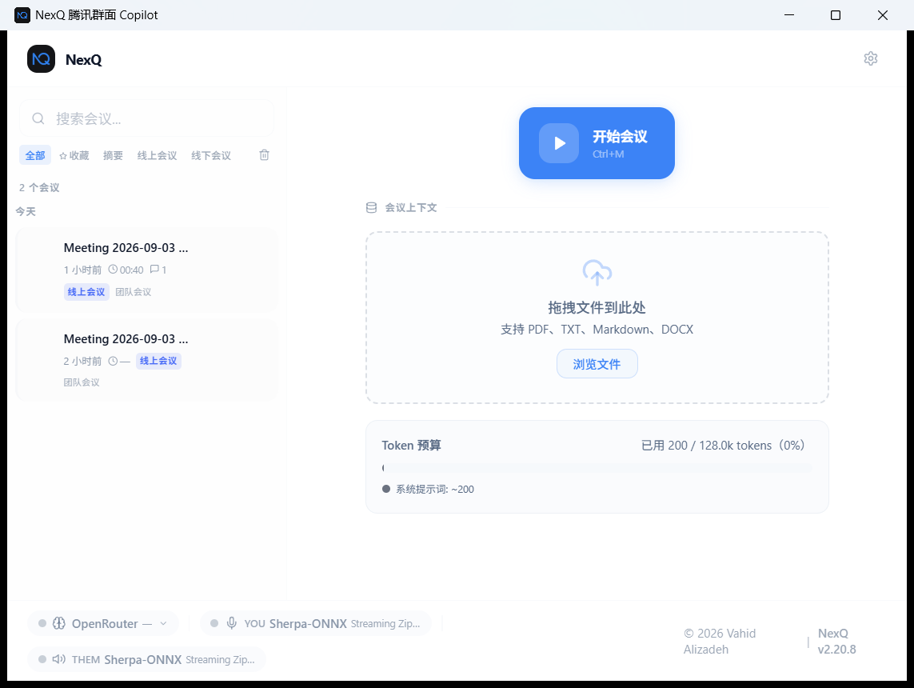
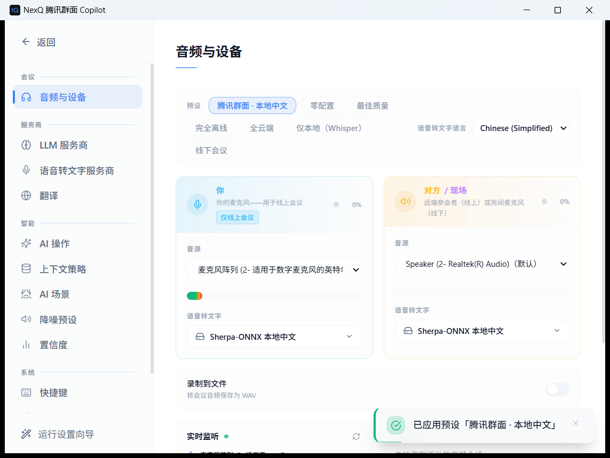
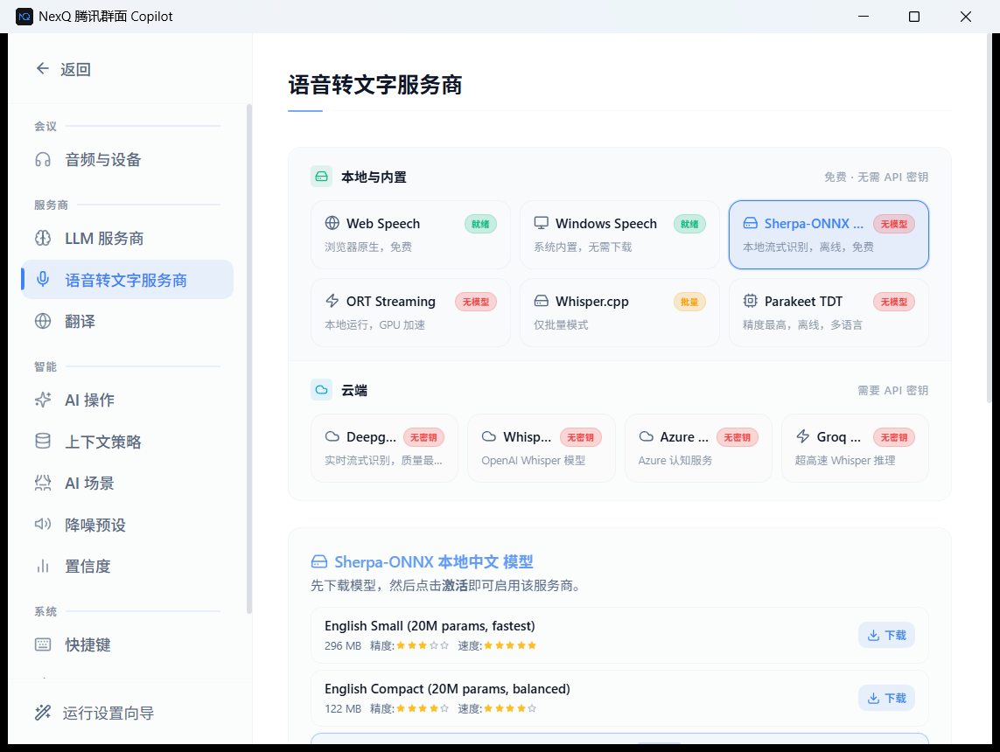
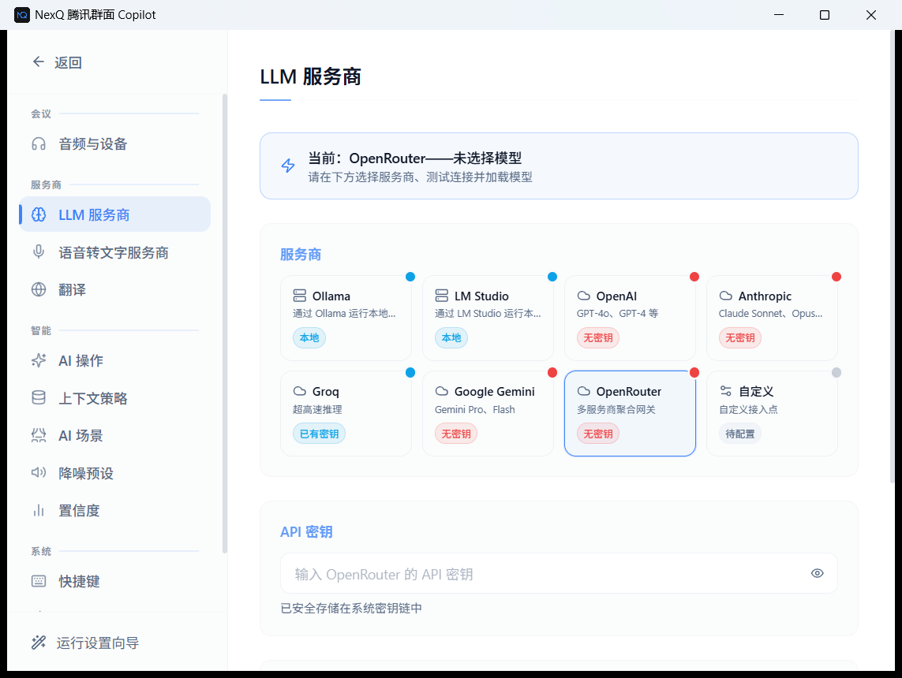
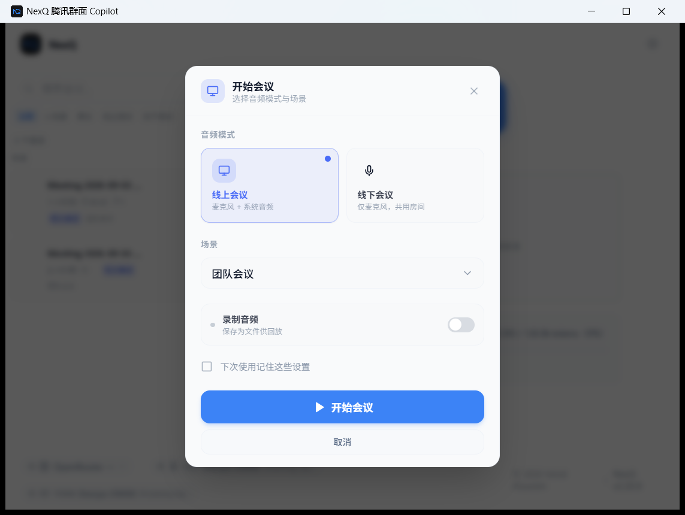
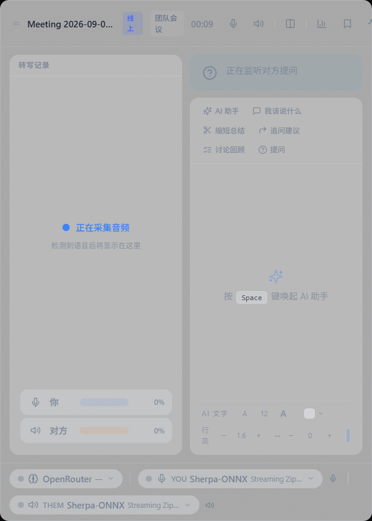
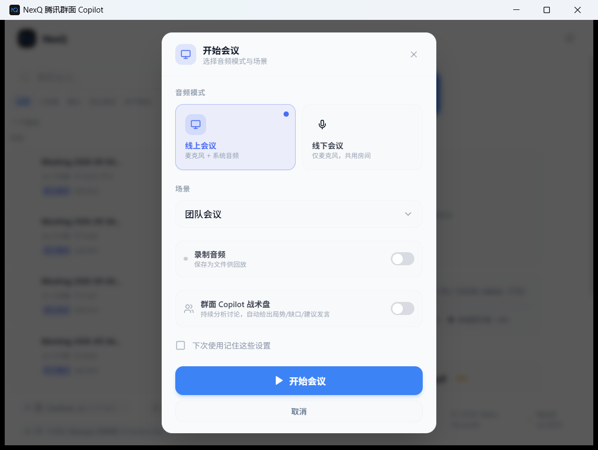
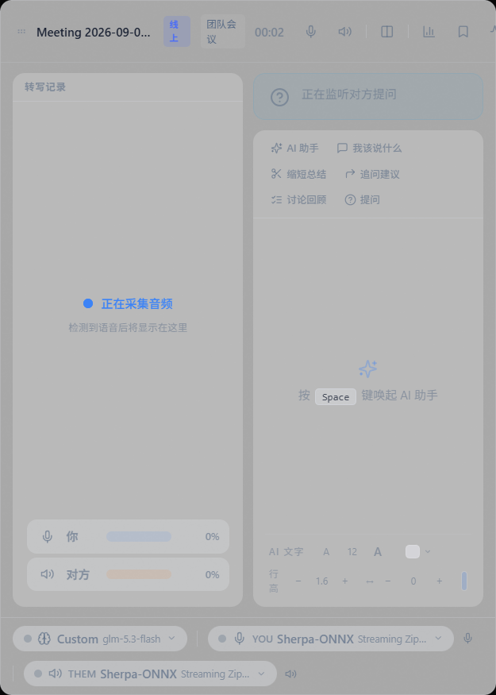

# NexQ 腾讯群面 Copilot 图文使用教程

> 本教程配有真实界面截图，跟着图片一步步操作即可。
> 读完你将学会：配置转写引擎 → 配置 AI → 开一场腾讯群面 → 会中拿建议 → 会后复盘。

---

## 目录

1. [认识主界面](#一认识主界面)
2. [一次性配置：音频与转写](#二一次性配置音频与转写)
3. [一次性配置：AI 模型](#三一次性配置ai-模型)
4. [开一场腾讯群面](#四开一场腾讯群面)
5. [会中：看懂悬浮窗、拿建议](#五会中看懂悬浮窗拿建议)
6. [群面 Copilot 战术盘（核心功能）](#群面-copilot-战术盘核心功能)
7. [会后复盘](#六会后复盘)
7. [快捷键总表](#七快捷键总表)
8. [常见问题](#八常见问题)

---

## 一、认识主界面

启动应用后看到的就是主界面（Launcher），所有功能都从这里出发：

| 区域 | 作用 |
|---|---|
| 左侧列表 | 最近会议记录，可搜索、按「线上会议 / 线下会议」筛选 |
| 右上「开始会议」按钮 | 点它（或按 `Ctrl+M`）开始一场会议 |
| 右侧「会议上下文」 | 把简历、岗位 JD 拖进来，AI 回答会引用这些内容 |
| 「Token 预算」 | 显示当前上下文占用 |
| 底部状态栏 | 从左到右：AI 服务商（OpenRouter）、你的转写通道（YOU）、对方通道（THEM）— 开会前扫一眼确认都是绿的 |

> ⚠️ 开会前先看底部状态栏：YOU 和 THEM 都应显示 **Sherpa-ONNX**（本地中文转写）。如果显示别的（如 Web Speech），按下一节重新应用预设。

---

## 二、一次性配置：音频与转写

### 1. 打开设置

点主界面右上角**齿轮图标**（或按 `Ctrl+,`）。

### 2. 进入「会议 → 音频与设备」，应用预设

点击预设里的「**腾讯群面 · 本地中文**」：

这一步会同时把「你」和「对方 / 现场」两路都设为 **Sherpa-ONNX 本地中文**（离线、免费、无需 API Key）。

### 3. 检查两个下拉框

- **你 → 音源**：选你的麦克风（截图中的「麦克风阵列」是笔记本内置麦；**戴耳机时选耳机麦克风**）
- **对方 / 现场 → 音源**：选**腾讯会议正在使用的扬声器/耳机**（截图中是 Speaker (Realtek Audio)）
- 语言保持 **Chinese (Simplified)**

> ⚠️ 三个必须：
> 1. **必须戴耳机**——外放声音会被麦克风二次拾取，转写出现重复
> 2. 「对方」的音源必须和腾讯会议实际播放设备**一致**——不一致就收不到其他人的声音
> 3. 腾讯会议里如果切换过音频设备，这里必须**重选**

### 4. 确认中文模型已激活

进入「服务商 → 语音转文字服务商」，在下方 **Sherpa-ONNX 本地中文 模型** 区域：

- 「中文流式 Zipformer（普通话 / 简体中文，296 MB）★ 推荐」右侧显示 **已激活** = 模型已就绪
- 如果显示「下载」按钮，点它等待下载完成，再回到「音频与设备」确认两路都选了它

---

## 三、一次性配置：AI 模型

进入「服务商 → LLM 服务商」：

### 推荐：OpenRouter（免费注册，模型多）

1. 打开 [openrouter.ai/keys](https://openrouter.ai/keys)，用 Google 账号注册
2. 点 **Create Key**，复制 `sk-or-v1-...` 开头的密钥（**只显示一次**）
3. 回到这个页面，点「OpenRouter」卡片 → 在 **API 密钥** 输入框粘贴
4. 点 **测试连接**，成功后加载模型，选一个带 `flash` 的轻量模型（响应快，适合实时）

### 备选：Groq

如果你在向导里填过 Groq 密钥（页面显示「已有密钥」），点 Groq 卡片直接用也可以，中文建议质量略弱于 Gemini 系列。

> API 密钥保存在 Windows 凭据管理器中，不会写入文件或日志。

---

## 四、开一场腾讯群面

1. **提前 10 分钟**：戴好耳机 → 加入腾讯会议 → 记住会议当前用的输出设备
2. 回到 NexQ 主界面，点「**开始会议**」（或 `Ctrl+M`）
3. 弹出会议设置：

- **音频模式**：选「**线上会议**」（麦克风 + 系统音频）
- **场景**：群面选「**面试**」（团队会议/讲座等是其他场景）
- 点「**开始会议**」
4. 腾讯群面悬浮窗出现，转写自动开始

---

## 五、会中：看懂悬浮窗、拿建议

悬浮窗（500×700，始终置顶，只有你能看到）长这样：

### 界面说明

| 区域 | 含义 |
|---|---|
| 左侧「转写记录」 | 实时文字流：「你」= 你说的，「对方」= 其他人说的。「正在采集音频」表示一切正常 |
| 「你 / 对方」音量条 | 两个都有波动 = 双路采集正常。**对方一直是 0% = 音源选错了**，回设置重选 |
| 右上模式按钮 | AI 助手 / 我该说什么 / 缩短总结 / 追问建议 / 讨论回顾 / 提问 |
| 「正在监听对方提问」 | 自动检测别人抛出的问题 |

### 怎么拿建议

- 按 **Space**：AI 立即分析当前讨论，给出可直接说出口的建议（2~5 秒）
- 或点对应模式按钮：
  - **我该说什么** — 冷场/想插话时用
  - **缩短总结** — 长讨论后快速概括
  - **追问建议** — 该你提问时用
  - **讨论回顾** — 总结目前进展（适合抢"总结者"角色）
  - **提问** — 自由输入任何问题
- 别人说完一段话后按 Space，比连续按效果好

### 使用姿势

- 悬浮窗拖到**摄像头附近**，像瞄笔记一样扫一眼，不要盯着看
- 自己要说长段话时，**中键点击托盘图标**静音麦克风，说完再取消

---

## 群面 Copilot 战术盘（核心功能）

群面（无领导小组讨论）专用模式。开启后悬浮窗变成极简战术盘，AI **自动**持续分析讨论并给出可直接说出口的建议。

### 开启方式

「开始会议」弹窗里打开「**群面 Copilot 战术盘**」开关：

- **群面题目**（可选）：粘贴题目，AI 围绕题目分析
- **讨论总时长**：20/30/45/60 分钟，用于倒计时提醒

### 战术盘界面

| 区域 | 说明 |
|---|---|
| 顶部 | 当前讨论阶段（如"审题""方案比较"）+ 剩余时间倒计时 + 手动分析按钮 |
| **局势** | 一句话概括讨论正在发生什么 |
| **缺口** | 尚未讨论到的关键维度（决策链、预算、交付、ROI 等） |
| **动作** | AI 建议你此刻的最佳动作：等待 / 补充 / 总结 / 推进 / 反驳 |
| **建议发言** | 可直接说出口的第一人称建议（80~120 字） |

### 运行规则

- **自动分析**：别人说完一段话后自动触发；最短 10 秒间隔，连续讨论最长 15 秒刷新
- **按 Space**：立即强制分析（绕过间隔）
- **不要抢话**：无值得补充的内容时显示"不要抢话 / 继续听"，不生成凑数建议
- **20 秒失效**：建议显示约 20 秒后自动消失；你自己发言后立即失效
- **个人背景**：主界面「会议上下文」里加载的简历/JD 会作为建议素材（建议提前放 2 页简历 + 1 页 JD）

> 要求：LLM 需为 OpenRouter / Groq / OpenAI 之一（本地模型也可）。群面模式与普通模式互不干扰，随时点悬浮窗右上「结束」退出。

---

## 六、会后复盘

1. 按 `Ctrl+M` 结束会议，记录自动保存
2. 主界面左侧点开这场会议：
   - **转写**：完整双路文字，可搜索、可导出
   - **AI 交互记录**：会中所有建议存档
   - **摘要 / 行动项**：自动生成
3. 面试前把高频问题整理进「会议上下文」，下一场 AI 建议更贴身

---

## 七、快捷键总表

**全局（任何界面都生效）：**

| 按键 | 功能 |
|---|---|
| `Ctrl+M` | 开始 / 结束会议 |
| `Ctrl+B` | 悬浮窗 ↔ 主窗口切换 |
| `Ctrl+,` | 打开 / 关闭设置 |
| `Ctrl+Shift+G` | 群面模式：立即强制分析（**腾讯会议全屏中也能按**） |

**会议中（NexQ 窗口聚焦时）：**

| 按键 | 功能 |
|---|---|
| `Space` | AI 分析当前对话 |
| `1` | 我该说什么 |
| `2` | 缩短总结 |
| `3` | 追问建议 |
| `4` | 讨论回顾 |
| `5` | 自由提问 |

**托盘图标**：双击 = 显示主窗口；中键 = 麦克风静音；右键 = 菜单

---

## 八、常见问题

| 现象 | 解决 |
|---|---|
| 「对方」通道没有文字 / 音量 0% | 腾讯会议切换过扬声器 → 设置 → 音频与设备，重选「对方」音源 |
| 转写出现重复句子 | 没戴耳机，外放漏音。戴耳机 |
| 点开始会议没反应/秒退 | 看底部状态栏是否报错；确认两路都是 Sherpa-ONNX 且模型已激活 |
| 按 Space 没有 AI 回复 | 底部状态栏看 LLM 状态；去设置 → LLM 服务商重新测试连接 |
| 声音突然变差 | 蓝牙耳机进入通话模式。换有线/USB 耳机 |
| 找不到主窗口 | 在系统托盘，双击图标唤出 |
| 彻底重置 | 退出应用，删除 `%APPDATA%\com.nexq.tencent-group-copilot` |

---

## 最后：正式群面前 5 分钟检查清单

- [ ] 耳机已戴
- [ ] 底部状态栏：YOU / THEM 均为 Sherpa-ONNX，无红色报错
- [ ] 「对方」音源 = 腾讯会议当前输出设备
- [ ] LLM 已测试连接成功
- [ ] Windows 勿扰模式开启
- [ ] 悬浮窗位置舒适
- [ ] 用腾讯会议个人房间 + 播放一段中文视频，完整演练过一遍
